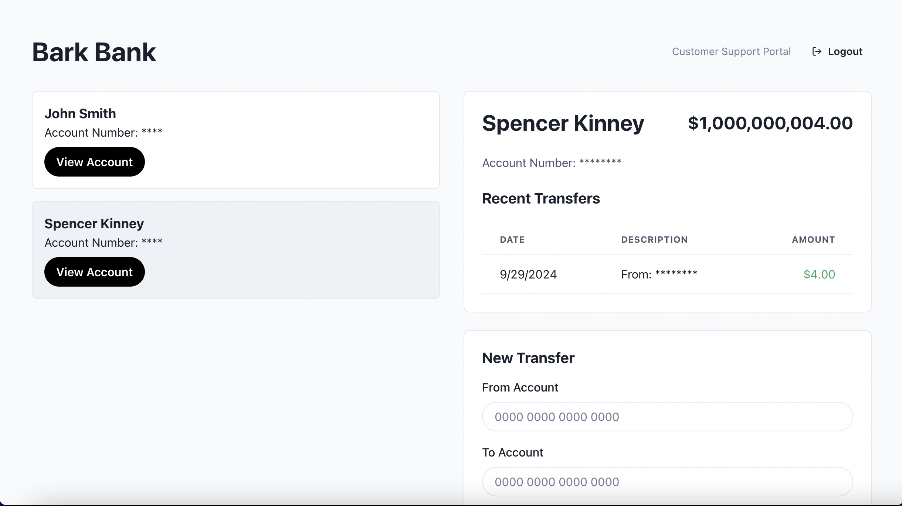

# Bark Banking API


A Django-based API designed to manage essential banking operations such as account creation, transfers, balances, and transaction history. This project includes attention to core security and database consistency measures while providing a simple yet functional banking system.

## Overview

The **Bark Banking API** includes:

- **Account Management**: Create and manage multiple bank accounts for users.
- **Fund Transfers**: Securely transfer funds between any two accounts, including across users.
- **Balance Inquiries**: Retrieve the current balance for any given account.
- **Transaction History**: View transfer history with the most recent transactions.

> **Note**: In this simplified demo, raw account numbers are stored. In real-world applications, sensitive data like account numbers should be hashed or encrypted using secure algorithms.

## Key Features

- **Atomic Transactions**: All financial operations are wrapped in database transactions to ensure consistency.
- **Security**: Basic security measures such as CSRF protection, token-based authentication, and SSL are implemented.
- **Database Management**: SQLite is used in development for local environments, while PostgreSQL is utilized in production, ensuring scalable and robust database operations.
- **Django ORM**: Utilizes Django's ORM to manage the database schema and migrations.
- **Whitenoise**: Serves static files efficiently in production.

## Configuration Notes

- **Production vs. Local Config**: The project includes both local and production configuration.
  - **Local**: Uses SQLite for in-memory database operations.
  - **Production**: Configured to use PostgreSQL with connection management via Heroku's `DATABASE_URL`.
  - Whitenoise is configured to serve static files in production for the API.

### Security Configurations (Production)

- **Session and CSRF Cookies** are secured with `SESSION_COOKIE_SECURE` and `CSRF_COOKIE_SECURE` to prevent unencrypted transmission.
- **XSS Protection**: The `SECURE_BROWSER_XSS_FILTER` and `SECURE_CONTENT_TYPE_NOSNIFF` settings are enabled to avoid security vulnerabilities.
- **X-Frame-Options**: `DENY` is set to protect against clickjacking attacks.
- **Trusted Origins**: The API and UI domains are whitelisted in the `CSRF_TRUSTED_ORIGINS` for CSRF protection.
  
## Getting Started

### 1. Clone the Repo

```bash
git clone https://github.com/spencerkinney/bark-bank-api.git
cd bark-bank-api
```

### 2. Install Dependencies

```bash
pip install -r requirements.txt
```

### 3. Run Migrations

```bash
python manage.py migrate
```

### 4. Create a Superuser

```bash
python manage.py createsuperuser
```

### 5. Start the Server

```bash
python manage.py runserver
```

### 6. View API Documentation

- **Swagger UI**: `http://localhost:8000/swagger/`
- **ReDoc**: `http://localhost:8000/redoc/`

## API Endpoints

### Account Management

- **Create Account**: `POST /api/accounts/`
- **Retrieve Account Details**: `GET /api/accounts/{account_id}/`
- **Get Account Balance**: `GET /api/accounts/{account_id}/balance/`
- **Get Account Transfer History**: `GET /api/accounts/{account_id}/transfers/`

### Transfers

- **Create Transfer**: `POST /api/transfers/`
- **Retrieve Transfer Details**: `GET /api/transfers/{transfer_id}/`

## Authentication

This API uses **Token Authentication**. To obtain a token:

1. Send a `POST` request to `/token/` with your credentials.
2. Include the received token in the `Authorization` header:

```
Authorization: Token your_token_here
```

## Future Considerations

- **Rate Limiting**: Implement to prevent abuse and ensure scalability.
- **JWT Tokens**: Replace permanent tokens with time-bound JWT tokens.
- **Two-Factor Authentication**: Implement RSA-based two-factor authentication for added security.
- **Data Encryption**: Hash or encrypt sensitive data such as account numbers in both the backend and the UI using algorithms like **bcrypt**.
- **Message Queues**: Decouple transactions and processing using tools like **Kafka** or **RabbitMQ** for better fault tolerance in case of server failure.
- **Partitioning and Indexing**: Proper database partitioning and indexing are necessary for a large-scale production system.
- **Improved UI**: Add better pagination, filtering, and layout for more effective management.
- **Unit Testing**: Implement comprehensive unit tests and a CI/CD pipeline for robust development and deployment processes.

## Deployment

- **UI**: [BarkBank UI](https://barkbank-e1493dbfdf9d.herokuapp.com/)
- **API**: [BarkBank API](https://barkbankapi-e88bfd94ccc1.herokuapp.com/)
    - [ReDoc Documentation](https://barkbankapi-e88bfd94ccc1.herokuapp.com/redoc/)



---

**Disclaimer**: *Bark Technologies is a financial technology company, not a bank.*

